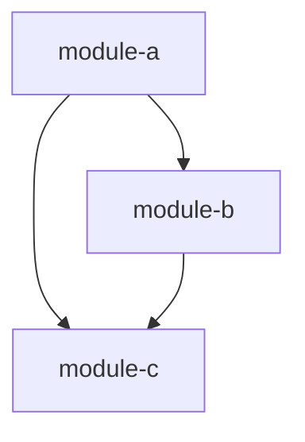

# Architecture Overview

> The high-level map of how this system is structured and why. Read it before
> making a structural change; update it — in the same change as the ADR, before
> any implementation — whenever an accepted decision alters the structure.

## Purpose and scope

_One or two paragraphs: what this system does, who uses it, and the boundaries
of what it is and isn't responsible for._

## System context

_How this system sits among its neighbours — the external systems, services,
and users it interacts with. Keep the diagram to the boundary; internal detail
belongs in "Module structure" below._

## Module structure

_The major modules / packages and what each is responsible for._

| Module | Responsibility |
|--------|----------------|
| _..._ | _..._ |

## Module dependencies

_How the modules depend on one another. This diagram is the first thing a
contributor consults before adding a module or a new dependency edge — keep it
current._

## Key design decisions

_The cross-cutting choices and conventions every contributor must follow. Link
each to the ADR that established it, so the rationale stays one click away._

- _... (see ADR NNNN)_

## Non-functional characteristics

_Whatever shapes the design beyond features: security posture, performance
constraints, deployability, observability, and any other quality attributes the
system must honour._
